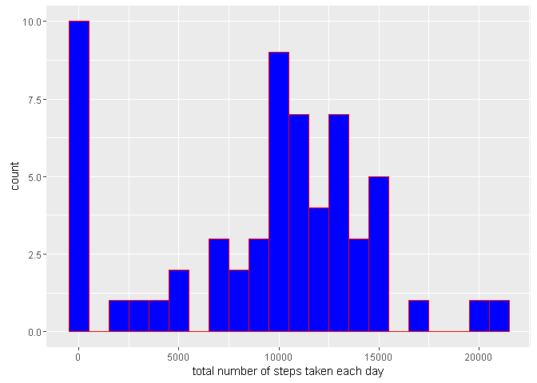
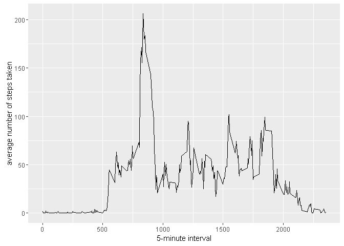
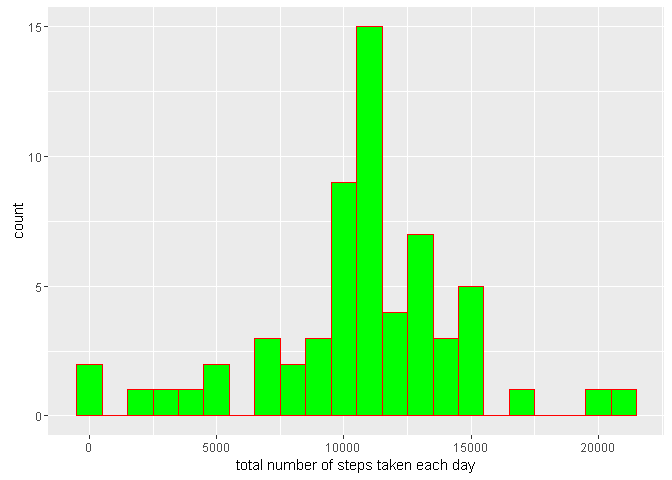
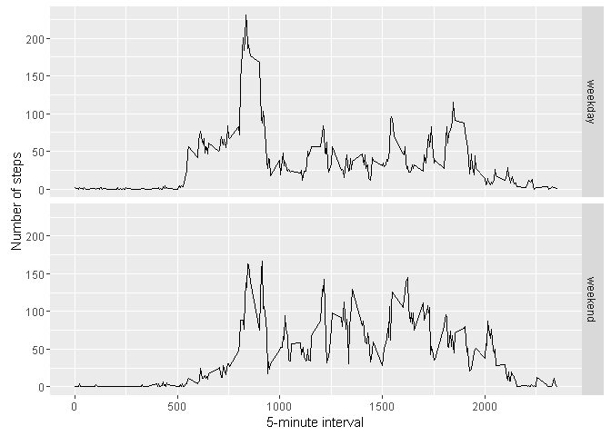

# Reproducible Research: Peer Assessment 1


## Loading and preprocessing the data


```r
activity <- read.csv("./data/activity.csv")
```

***

## What is mean total number of steps taken per day?

#### LEt´s use ggplot:

```r
library(ggplot2)
```
#### We need to add all steps grouping by day, before plot:

```r
steps_by_day <- tapply(activity$steps, activity$date, FUN=sum, na.rm=TRUE)
```

#### Then, plot the Histogram:

```r
qplot(steps_by_day, binwidth=1000, geom="histogram", xlab="total number of steps taken each day", fill=I("blue"), col=I("red"))
```



#### Mean:

```r
mean(steps_by_day, na.rm=TRUE)
```

```
## [1] 9354.23
```

#### Median:

```r
median(steps_by_day, na.rm=TRUE)
```

```
## [1] 10395
```


***

## What is the average daily activity pattern?
#### LEt´s use ggplot:

```r
library(ggplot2)
```

#### Agregate STEPS by Interval:

```r
averages <- aggregate(x=list(steps=activity$steps), by=list(interval=activity$interval),
                      FUN=mean, na.rm=TRUE)
ggplot(data=averages, aes(x=interval, y=steps)) +
    geom_line() +
    xlab("5-minute interval") +
    ylab("average number of steps taken")
```



### Which 5-minute interval, on average across all the days in the dataset, contains the maximum number of steps?

```r
averages[which.max(averages$steps),]
```

```
##     interval    steps
## 104      835 206.1698
```

***

## Imputing missing values
> Note that there are a number of days/intervals where there are missing values (coded as NA). The presence of missing days may introduce bias into some calculations or summaries of the data.

### Calculate and report the total number of missing values in the dataset (i.e. the total number of rows with NAs):

```r
missing <- is.na(activity$steps)
table(missing)
```

```
## missing
## FALSE  TRUE 
## 15264  2304
```

### The strategy for filling in all of the missing values in the dataset is to in with mean value for that 5-minute interval.
#### Let´s create a function, that calculates the average steps on a specific interval:

```r
fill.value <- function(steps, interval) {
                    filled <- NA
                    if (!is.na(steps))
                    filled <- c(steps)
                          else
                    filled <- (averages[averages$interval==interval, "steps"])
                    return(filled)
}
```
                      
#### Filling Data:

```r
filled.data <- activity
filled.data$steps <- mapply(fill.value, filled.data$steps, filled.data$interval)
```

#### Histogram of the total number of steps taken each day and calculate the mean and median total number of steps.

```r
total.steps <- tapply(filled.data$steps, filled.data$date, FUN=sum)
qplot(total.steps, binwidth=1000, geom="histogram", xlab="total number of steps taken each day", fill=I("green"), col=I("red"))
```



##### Mean:

```r
mean(total.steps)
```

```
## [1] 10766.19
```
##### Median:

```r
median(total.steps)
```

```
## [1] 10766.19
```

> Mean and median values are higher after imputing missing data. The N.A. values are not counted, son, they are non existent. This reflects as ZERO on the Histogram. However,  replacing the N.A.s values by the mean, we have values instead of zeroes, increasing the data velue in the histogram, and the meand and median.

***

## Are there differences in activity patterns between weekdays and weekends?
> First, let's find the day of the week for each measurement in the dataset. In this part, we use the dataset with the filled-in values.

#### Let´s create a function to identify week days:
> Please, note in the code that I needed to put two week name languages: english, to run in a Standard computer, and Portuguese, to run in my own machine. In this way, the code will run on both languages.


```r
weekday.or.weekend <- function(date) {
    day <- weekdays(date)
    if (day %in% c("segunda-feira", "terça-feira", "quarta-feira", "quinta-feira", "sexta-feira","Monday", "Tuesday", "Wednesday", "Thursday", "Friday"))
        return("weekday")
    else if (day %in% c("sábado", "domingo","Saturday", "Sunday"))
        return("weekend")
    else
        stop("invalid date")
}
```

#### With the function created above, we add a column on the data, with identification for WEEKDAY or WEEKEND:


```r
filled.data$date <- as.Date(filled.data$date)
filled.data$day <- sapply(filled.data$date, FUN=weekday.or.weekend)
```


#### Here a panel plot containing plots of average number of steps taken on weekdays and weekends.

```r
averages <- aggregate(steps ~ interval + day, data=filled.data, mean)
ggplot(averages, aes(interval, steps)) + geom_line() + facet_grid(day ~ .) +
    xlab("5-minute interval") + ylab("Number of steps")
```


